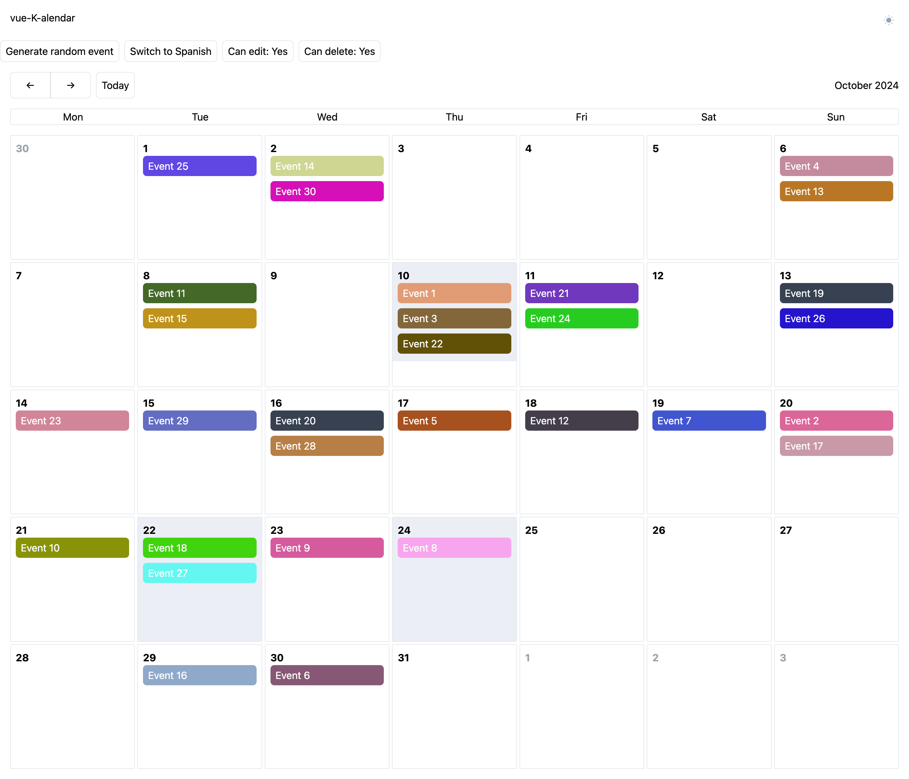
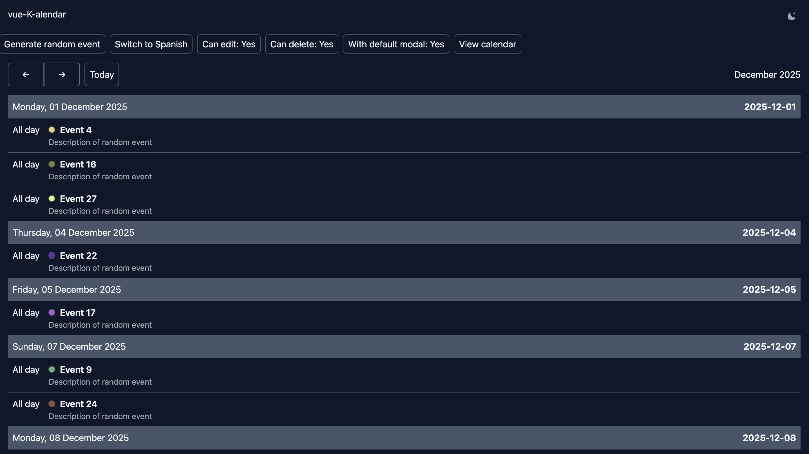

# Docs

## What is vue-k-alendar

The `@deskevinmendez/vue-k-alendar` is a simple calendar created without dependencies for printing events in a calendar.

<div style="margin: 0 auto;">
  
  
</div>

## Dark mode support

<div style="margin: 0 auto; padding-top: 16px;">
  
  
</div>

Mobile support

<div style="margin: 0 auto; padding-top: 16px;">
  
  
</div>


## Installation

- Pnpm

```bash
pnpm install @deskevinmendez/vue-k-alendar
```

- Yarn

```bash
yarn add @deskevinmendez/vue-k-alendar
```

- NPM

```bash
npm  install @deskevinmendez/vue-k-alendar
```

## Usage

```vue
<template>
  <KAlendar
    :lang="'es'"
    :events="events"
    @nextMonth="handleNextMonth"
    @prevMonth="handlePrevMonth"
    @toToday="handleToToday"
    @event="handleEvent"
    @events="handleEvents"
    @date="handleDate"
    @day="handleDay"
  />
</template>

<script>
import { ref } from 'vue'
import KAlendar from '@deskevinmendez/vue-k-alendar'
import '@deskevinmendez/vue-k-alendar/style.css'

export default {
  components: {
    KAlendar
  },
  setup() {
    const events = ref([
      {
        id: '1',
        title: 'Event 1',
        start_date: '2024-08-16T00:35:00.000000Z',
        end_date: '2024-08-17T00:35:00.000000Z',
        description: 'Description of event 1',
        color: '#a02222',
      }
      // more events...
    ])

    const handleNextMonth = (date) => {
      console.log('Next month:', date)
    }

    const handlePrevMonth = (date) => {
      console.log('Previous month:', date)
    }

    const handleToToday = (date) => {
      console.log('To today:', date)
    }

    const handleEvent = (event) => {
      console.log('Event clicked:', event)
    }

    const handleEvents = ({ events }) => {
      console.log('Plus event count clicked:', events)
    }

    const handleDate = ({ day, events }) => {
      console.log('Date clicked:', day, events)
    }

    const handleDay = (day) => {
      console.log('Day clicked:', day)
    }

    return {
      events,
      handleNextMonth,
      handlePrevMonth,
      handleToToday,
      handleEvent,
      handleEvents,
      handleDate,
      handleDay
    }
  }
}
</script>
```

## Dark mode support

The calendar component has been created with tailwind, and support the dark mode of the tailwind by default

## Props

| Prop Name          | Type    | Default       | Description                                    |
| ------------------ | ------- | ------------- | ---------------------------------------------- |
| `lang`             | String  | `'en'`        | Language for the calendar (e.g., 'en', 'es').  |
| `events`           | Array   | `[]`          | List of events to display in the calendar.     |
| `view`             | String  | `'calendar'`  | View of the calendar (e.g., 'calendar', 'list', 'day'). |

## Events

| Event Name              | Description                                                  |
| ----------------------- | ------------------------------------------------------------ |
| `nextMonth`             | Emitted when the user navigates to the next month.           |
| `prevMonth`             | Emitted when the user navigates to the previous month.       |
| `toToday`               | Emitted when the user navigates to the current month.        |
| `event`          | Emitted when an event is clicked.                            |
| `events` | Emitted when the user clicks on the 'more events' indicator (showing +X events) or when multiple events are clicked on mobile. |
| `date` | Emitted when the user clicks on a date. |
| `day` | Emitted when the user changes the day in the day view. |

## Typescript

The events should be a type of

```ts
export type KEvent = {
  id: string
  title: string
  start_date: string
  end_date?: string | null
  description: string
  color?: string
}
```

::: tip
Use the import `import { type KEvent } from "@deskevinmendez/vue-k-alendar";`
:::

The emits returns a type `KEventEmit`

```ts
export type KEventEmit = {
  event: KEvent
}
```

::: tip
and you can import as `import { type KEventEmit } from "@deskevinmendez/vue-k-alendar";`
:::
